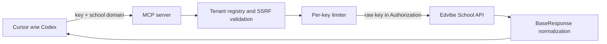

# Контекст проекта Edvibe MCP

## Цель

Сделать Edvibe удобнее и популярнее за счёт официального MCP-сервера, через который клиенты с доступным School API смогут использовать его в совместимых AI-инструментах. Целевой пользователь вводит только:

1. свой API-ключ Edvibe;
2. домен своей школы Edvibe или White Label.

Техническая аудитория v1 — школы Edvibe/ProgressMe на Pro, где доступен API-модуль. Стратегическая цель — все клиенты, но MCP не может самостоятельно открыть API на Standard или других тарифах; это отдельная продуктовая зависимость и решение Edvibe.

Первый поддерживаемый сценарий — локальная работа в Cursor и Codex. После личного пилота проект должен быть передан Edvibe, пройти закрытую бету и стать официальным публичным MCP-сервером на инфраструктуре Edvibe.

## Граница текущей работы

Сейчас подготовлен только пакет передачи. Ещё не выполнены:

- создание Git-репозитория;
- создание или публикация Postman workspace, API и коллекции;
- работа в интерфейсе Postman MCP Generator;
- генерация или доработка кода сервера;
- запросы к live API с тестовым ключом;
- deployment;
- публикация в Postman MCP Catalog.

Любое утверждение о готовности должно явно различать локальное состояние, staging и production.

## Официальные источники

- [Edvibe School API — Swagger UI](https://edvibe.com/school-api/swagger/index.html)
- [Edvibe School API — raw OpenAPI](https://edvibe.com/school-api/swagger/v1/swagger.json)
- [Postman MCP Generator](https://www.postman.com/explore/mcp-generator)
- [Postman — Generate an MCP server](https://learning.postman.com/docs/postman-api-network/showcase/publish/mcp-servers/generate)
- [Postman — Set up and start a generated MCP server](https://learning.postman.com/docs/postman-api-network/showcase/publish/mcp-servers/set-up-start)
- [Postman — Promote an MCP server](https://learning.postman.com/docs/postman-api-network/showcase/publish/mcp-servers/promote)
- [OpenAI Docs — MCP in Codex](https://developers.openai.com/codex/mcp/)
- [Cursor — MCP](https://cursor.com/docs/mcp)
- [Model Context Protocol — Tool annotations](https://modelcontextprotocol.io/specification/2025-11-25/schema#toolannotations)

Снимок фактов ниже перепроверен по raw OpenAPI 22 августа 2026 года. Перед началом реализации схему нужно сохранить в репозитории как неизменяемый исходный снимок и проверить, не изменилась ли опубликованная версия.

## Подтверждённые факты об Edvibe School API

| Параметр | Значение |
|---|---|
| Формат | OpenAPI `3.0.4` |
| Версия API | `v1` |
| Заголовок схемы | `CabinetApi.School.WebApi` |
| Базовый путь | `/school-api` |
| Полный адрес | `https://{SchoolDomain}/school-api/{Endpoint}` |
| Число операций | **78** |
| HTTP-методы | 28 `GET`, 50 `POST` |
| Группы в фактических путях | 14 |
| JSON request body | 35 операций |
| Multipart, webhooks, async callbacks | в схеме отсутствуют |
| Лимит | не более 15 запросов в секунду на токен; при превышении — `429` |

Авторизация описана как `apiKey` в заголовке `Authorization`. Несмотря на имя security scheme `Bearer`, upstream API ожидает **сам ключ без префикса `Bearer`**.

Типовой ответ использует оболочку `BaseResponse`: `isSuccess`, `errorMessage`, `errorStackTrace`, `status`, `data`.

MCP-сервер обязан считать `HTTP 200` вместе с `isSuccess=false` ошибкой инструмента. `errorStackTrace` нельзя отдавать клиенту или писать в логи.

## Особенности исходной схемы

- У операций нет `operationId`; стабильные английские идентификаторы нужно добавить в нормализованную копию.
- В названиях схем много внутренних .NET-типов.
- В описаниях встречаются опечатки и неоднозначности. Например, summary для `IndividualClasses/Create` говорит о групповом классе.
- Параметры пагинации встречаются в dotted-форме. Для MCP нужны понятные входы и обратное преобразование к upstream-параметрам.
- Многие request body формально не помечены как required. Нельзя ужесточать обязательность без подтверждения контрактом или безопасной проверкой.
- Не все чтения используют `GET`; восемь read-only операций используют `POST`.
- `GET /api/Marathon/AddMarathonNewStudents` меняет состояние, поэтому HTTP-метод нельзя использовать как единственный признак риска.
- В Swagger UI тег Marathon отображается непоследовательно; нормализованная схема должна явно сохранить эту группу.
- Help center и Swagger расходятся по некоторым удалениям и исключениям из марафона. Перед публичным выпуском всех 78 инструментов это нужно подтвердить у product/engineering, в частности у Димы или Полины. До подтверждения операции нельзя молча исключать из контракта.

## Расхождения upstream OpenAPI vs live-поведение

Расхождения выявлены безопасными пробами против live-API на школе `edvibe.com` 22 августа 2026 года (личный пилот Руслана, ключ из локального окружения). Каждая запись фиксирует: операцию, минимальный запрос, наблюдаемый статус и сообщение upstream, действие, которое делает вызов успешным, и product-owner вопроса. Изменения requiredness вносятся только через воспроизводимый overlay `scripts/required-overrides.cjs`; генерируемые артефакты правке вручную не подлежат.

| operationId | Метод и путь | Минимальный запрос upstream | Наблюдение | Что делает вызов успешным | OpenAPI | Фактически | Вопрос product/engineering |
|---|---|---|---|---|---|---|---|
| `PupilsCreate` | `POST /api/Pupils/Create` | `{ name: "Anna (demo)", isActive: false }` | HTTP 500 с пустым телом ответа | Добавление поля `email` | `name` — required, `email` — optional | `email` — required | Подтвердить обязательность `email` для `PupilsCreate` и причины пустого тела 500 (отсутствие понятной ошибки — отдельная проблема API). |
| `TeachersCreate` | `POST /api/Teachers/Create` | `{ name: "Elena (demo)" }` | HTTP 400, `isSuccess=false`, `errorMessage="Введённый адрес электронной почты является некорректным"` | Добавление поля `email` | `email` — optional | `email` — required | Подтвердить обязательность `email` для `TeachersCreate` и привести OpenAPI в соответствие с поведением. |

Контрольные ID, созданные в ходе проб (для последующего cleanup): учителя `3577063`–`3577067`, ученики `3577069`–`3577073`. Все записи созданы с `isActive=false` и синтетическими email на зарезервированном домене `example.com` (RFC 2606). Записи подлежат удалению через `TeachersDelete` / `PupilsDelete` после Gate B.

### Дополнительные live-наблюдения (ScheduleCreateLesson + IndividualClassesCreate)

Эти наблюдения не являются расхождениями requiredness, но фиксируют неочевидное поведение upstream, выявленное 22 августа 2026 года на `edvibe.com` через `ScheduleCreateLesson` и `IndividualClassesCreate`.

| operationId | Наблюдение | Что говорит upstream | Что происходит фактически | Вопрос product/engineering |
|---|---|---|---|---|
| `ScheduleCreateLesson` | Поле `groupId` принимает ID любого класса, не только группового. | Описание: «Идентификатор группы». | Передача `classId` от `IndividualClassesCreate` принимается и создаёт урок в индивидуальном классе. | Подтвердить, что `groupId` — это ID любого класса; обновить описание в OpenAPI на «Идентификатор класса (группового или индивидуального)». |
| `ScheduleCreateLesson` | Создание урока автоматически активирует ученика. | В схеме нет признака побочной активации. | Каждый успешный ответ содержит `isActivatedPupil: true`. Ученики, созданные с `isActive=false`, после назначения урока становятся активными. | Подтвердить, что авто-активация — документированное поведение. Если да, добавить это в description операции и рассмотреть, нужна ли отдельная annotation для побочного state change. |

Контрольные ID, созданные в ходе этих проб (для последующего cleanup): индивидуальные классы `2354995`–`2355000` (с пропуском `2354998`, который upstream зарезервировал/не вернул), уроки `29459741`–`29459745`. Все уроки запланированы на `2026-08-23` 10:00–14:00 UTC, по 60 минут. Записи подлежат удалению через `ScheduleDeleteLesson` и `IndividualClassesDelete` после Gate B.

### Дополнительные live-наблюдения (GroupClassesCreate + GroupClassPupilsAdd)

Зафиксировано 22 августа 2026 года на `edvibe.com` через `GroupClassesCreate` и `GroupClassPupilsAdd`.

| operationId | Наблюдение | Что говорит upstream | Что происходит фактически | Вопрос product/engineering |
|---|---|---|---|---|
| `GroupClassPupilsAdd` | `classId` передаётся как query-параметр, а `pupilIds` — в body. | В OpenAPI `classId` объявлен как query-параметр (required), `pupilIds` — поле body. | Передача `classId` в body игнорируется; вызов падает. Работает только `?classId=<id>` + body `{ pupilIds: [...] }`. | Подтвердить асимметричное размещение параметров. Это расходится с `GroupClassesCreate` и `IndividualClassesCreate`, где все поля в body. Желательно привести к единообразию или явно задокументировать. |

Контрольные ID, созданные в ходе этих проб (для последующего cleanup): групповые классы `2355017` («English A2 (demo)», учитель Zhanna, ученики Anna/Viktor/Dmitry) и `2355018` («English B1 (demo)», учитель Kirill, ученики Boris/Galina). Записи подлежат удалению через `GroupClassesDelete` после Gate B.

### Побочные наблюдения

- `PupilsCreate` на пустом теле возвращает HTTP 500 без тела. Это нарушение контракта `BaseResponse`: ни `isSuccess`, ни `errorMessage`, ни `errorStackTrace`. Сервер MCP обязан воспринимать 5xx без тела как upstream-ошибку и не пытаться парсить `BaseResponse`.
- `TeachersCreate` на 400 всё же возвращает `BaseResponse`, но с непустым `errorStackTrace: null`. Это означает, что на иных 4xx/5xx `errorStackTrace` может быть непустым. Известный пробел в `src/upstream.js`: stripping `errorStackTrace` применяется только к 2xx-ответам, а 4xx/5xx отдаются клиенту как сырая строка body. Это нарушение контракта безопасности из `AGENTS.md` и подлежит отдельному фиксу.
- `BooksGetBooksSchool` — `POST` с телом-пустышкой `{}` (схема `GetBooksSchoolRequest` без полей). Upstream требует наличия тела и возвращает 400 `A non-empty request body is required`, если тело опущено. Исправлено в `src/upstream.js`: при `hasBody=true` тело сериализуется всегда, даже пустое.

## Полный инвентарь 78 операций

Классы риска ниже являются обязательной исходной разметкой. Их нужно подтвердить тестами по фактическому поведению, а не выводить из `GET`/`POST`.

- `read` — чтение, 35 операций;
- `write` — обычное изменение состояния, 24 операции;
- `high-risk` — удаление, отвязка, списание или другое труднообратимое изменение, 17 операций;
- `sensitive` — выдача login-токена, 2 операции.

| № | Метод и путь | Класс |
|---:|---|---|
| 1 | `GET /api/AccessGroups/GetList` | read |
| 2 | `GET /api/AccessGroups/GetDetails` | read |
| 3 | `GET /api/AccessGroups/GetTeachers` | read |
| 4 | `GET /api/AccessGroups/GetIndividualClasses` | read |
| 5 | `GET /api/AccessGroups/GetGroupClasses` | read |
| 6 | `POST /api/AccessGroups/Create` | write |
| 7 | `POST /api/AccessGroups/Delete` | high-risk |
| 8 | `POST /api/AccessGroups/AddMembers` | write |
| 9 | `POST /api/AccessGroups/RemoveMembers` | high-risk |
| 10 | `POST /api/Books/GetBooksPlatform` | read |
| 11 | `POST /api/Books/GetBooksSchool` | read |
| 12 | `POST /api/Books/GetBook` | read |
| 13 | `POST /api/Books/PinLessonToClass` | write |
| 14 | `POST /api/Classes/GetStatistics` | read |
| 15 | `GET /api/GroupClasses/GetList` | read |
| 16 | `GET /api/GroupClasses/GetDetail` | read |
| 17 | `POST /api/GroupClasses/Create` | write |
| 18 | `POST /api/GroupClasses/Update` | write |
| 19 | `POST /api/GroupClasses/ChangeTeacher` | write |
| 20 | `POST /api/GroupClasses/Delete` | high-risk |
| 21 | `GET /api/GroupClassPupils/GetList` | read |
| 22 | `POST /api/GroupClassPupils/Add` | write |
| 23 | `POST /api/GroupClassPupils/Delete` | high-risk |
| 24 | `GET /api/IndividualClasses/GetList` | read |
| 25 | `GET /api/IndividualClasses/GetDetail` | read |
| 26 | `POST /api/IndividualClasses/ChangeTeacher` | write |
| 27 | `POST /api/IndividualClasses/Create` | write |
| 28 | `POST /api/IndividualClasses/Update` | write |
| 29 | `POST /api/IndividualClasses/Delete` | high-risk |
| 30 | `GET /api/LessonPackages/GetList` | read |
| 31 | `POST /api/LessonPackages/SetPackage` | write |
| 32 | `POST /api/LessonPackages/UpdatePackagePeriod` | write |
| 33 | `POST /api/LessonPackages/WriteOffLessons` | high-risk |
| 34 | `GET /api/LessonTariffs/GetList` | read |
| 35 | `GET /api/LessonTariffs/GetTariffForDurationId` | read |
| 36 | `POST /api/LessonTariffs/Create` | write |
| 37 | `POST /api/LessonTariffs/Delete` | high-risk |
| 38 | `POST /api/LessonTariffs/AddTariffDuration` | write |
| 39 | `GET /api/LessonTariffs/GetTariffDurationList` | read |
| 40 | `POST /api/LessonTariffs/DeleteTariffDuration` | high-risk |
| 41 | `POST /api/LessonTariffs/DeleteLessonPackage` | high-risk |
| 42 | `POST /api/Marathon/ChangeActivationMarathonPupil` | high-risk |
| 43 | `GET /api/Marathon/GetMarathonList` | read |
| 44 | `GET /api/Marathon/GetMarathonStudents` | read |
| 45 | `GET /api/Marathon/AddMarathonNewStudents` | write |
| 46 | `POST /api/Marathon/CreateModerator` | write |
| 47 | `POST /api/Marathon/DeleteModerator` | high-risk |
| 48 | `POST /api/Marathon/SetPupilsForModerator` | write |
| 49 | `POST /api/Marathon/SetModeratorsForPupil` | write |
| 50 | `POST /api/Marathon/UnsetPupilsForModerator` | high-risk |
| 51 | `POST /api/Marathon/UnsetModeratorsForPupil` | high-risk |
| 52 | `GET /api/Marathon/GetModerators` | read |
| 53 | `GET /api/Pupils/GetList` | read |
| 54 | `GET /api/Pupils/GetCursorList` | read |
| 55 | `GET /api/Pupils/GetDetail` | read |
| 56 | `POST /api/Pupils/Create` | write |
| 57 | `POST /api/Pupils/Update` | write |
| 58 | `POST /api/Pupils/Delete` | high-risk |
| 59 | `GET /api/PupilTag/GetList` | read |
| 60 | `POST /api/PupilTag/Create` | write |
| 61 | `POST /api/PupilTag/Delete` | high-risk |
| 62 | `POST /api/Schedule/GetSchoolSchedule` | read |
| 63 | `POST /api/Schedule/GetPupilSchedule` | read |
| 64 | `GET /api/Schedule/GetTeacherWeekWorkTime` | read |
| 65 | `GET /api/Schedule/GetSchoolWeekWorkTime` | read |
| 66 | `GET /api/Schedule/GetPackageForIndividualLesson` | read |
| 67 | `GET /api/Schedule/GetPackageForGroupLesson` | read |
| 68 | `POST /api/Schedule/GetTeacherSchedule` | read |
| 69 | `POST /api/Schedule/CreateLesson` | write |
| 70 | `POST /api/Schedule/DeleteLesson` | high-risk |
| 71 | `GET /api/Teachers/GetList` | read |
| 72 | `GET /api/Teachers/GetDetail` | read |
| 73 | `POST /api/Teachers/Create` | write |
| 74 | `POST /api/Teachers/Update` | write |
| 75 | `POST /api/Teachers/Delete` | high-risk |
| 76 | `POST /api/UserAuth/LoginPupil` | sensitive |
| 77 | `POST /api/UserAuth/LoginTeacher` | sensitive |
| 78 | `POST /api/UserAuth/CheckAuthToken` | read |

Контрольная сумма классификации: **35 + 24 + 17 + 2 = 78**.

## Состояние Postman на момент передачи

- Доступ к аккаунту через Postman MCP подтверждён.
- В аккаунте были личное и командное рабочие пространства, но готовых Edvibe School API spec/collection не было.
- Идентификаторы аккаунта, workspace и email намеренно не сохранены в этом пакете.
- Для пилота нужно создать **отдельное** публичное Postman workspace. Нельзя превращать существующее личное workspace в публичное: там могут находиться несвязанные коллекции.
- Публичная коллекция может появиться на раннем этапе, но должна быть явно помечена как `experimental` и `unofficial` до официальной передачи Edvibe.
- Postman MCP Generator принимает запросы из Public API Network, генерирует Node.js-проект/ZIP для STDIO или Streamable HTTP, но сам сервер не размещает.
- Доступный Postman MCP не автоматизирует интерфейс Generator. Выбор всех 78 запросов и скачивание ZIP — ручной шаг в веб-интерфейсе.
- Для официальной публикации понадобятся профиль издателя Edvibe, подтверждение домена и обращение на `api-network@postman.com` для передачи материалов в Postman MCP Catalog; это выполняется только после передачи проекта Edvibe.

## Принятые решения

### Владение и репозиторий

- Начать в отдельном приватном Git-репозитории `edvibe-school-mcp`.
- После личного пилота передать репозиторий в официальную организацию Edvibe.
- Production-инфраструктура, домен, мониторинг и доступы должны принадлежать Edvibe, а не личному аккаунту Руслана.

### Объём первой версии

- Сохранить все 78 операций. Не сокращать набор ради простоты генерации.
- Основная аудитория v1 — школы Edvibe/ProgressMe на тарифе Pro, поскольку модуль API относится к Pro.
- Локально поддержать Cursor и Codex.
- Cursor Cloud, Cursor auto-run и ChatGPT-коннектор не входят в v1.
- Публичные имена инструментов, descriptions, examples, onboarding и README репозитория — на английском. Внутренняя рабочая документация и общение с Русланом — на русском.

### Развёртывание

- Личный пилот: локальный STDIO-сервер.
- Staging после передачи Edvibe: `https://mcp-staging.edvibe.com/mcp`.
- Production: Streamable HTTP на `https://mcp.edvibe.com/mcp`.

### Ввод клиентских данных

Для локального STDIO клиент передаёт key/domain через локальные переменные окружения или защищённое хранилище клиента. Для публичного HTTP предполагается:

- `Authorization: Bearer <EDVIBE_API_KEY>`;
- `X-Edvibe-School-Domain: <hostname>`.

MCP-сервер снимает префикс `Bearer` и передаёт upstream только исходное значение ключа в `Authorization`. Ключ и домен существуют только в контексте конкретного запроса/сессии.

В сохранённой базе знаний ProgressMe указано: ключ показывается только при создании, одновременно действует один ключ, а перевыпуск отключает предыдущий. Применимость этой логики к Edvibe нужно подтвердить на тестовой школе; onboarding и сервер в любом случае должны поддерживать безопасную ротацию без общей перезагрузки.

## Целевая архитектура

Сервер должен быть stateless. Глобальное состояние с последним ключом или доменом запрещено, поскольку оно создаёт риск утечки между школами.

## Безопасность

### Ключи, токены и PII

- API-ключ никогда не возвращать в tool result и не сохранять в Git, Markdown, Postman environment, shared workspace, БД, telemetry, логах, exceptions или кэше.
- PII можно передавать только авторизованному вызывающему клиенту в успешном результате операции, контракт которой требует эти данные; возвращать только необходимые поля и не сохранять результат на сервере.
- `LoginPupil` и `LoginTeacher` могут вернуть login-токен только в прямом успешном tool result, иначе эти две операции неработоспособны. Никогда не писать токен в логи, ошибки или кэш; перед публичным включением этих tools требуется отдельное product/security approval с учётом того, что MCP-клиент может сохранить историю вызова.
- Тестовый ключ существует, но вводится только локально через shell environment или Postman Local Vault. Его нельзя просить прислать в чат.
- Не логировать request/response bodies по умолчанию.
- Редактировать заголовки `Authorization`, cookie, login-токены и поля с PII до любой записи логов.
- Полностью удалять `errorStackTrace` из пользовательских ошибок.

### White Label и SSRF

Домен школы — пользовательский ввод, поэтому обязательна защита от SSRF:

Критическое правило: API-ключ нельзя пересылать на произвольный публичный hostname. Защита от private IP сама по себе не предотвращает кражу ключа через домен злоумышленника.

- принимать только hostname, без scheme, path, query, fragment, credentials и port;
- до добавления `Authorization` подтверждать hostname по authoritative registry/allowlist доменов школ, который контролирует Edvibe;
- в личном пилоте использовать явный allowlist тестовой школы; без официального реестра публичный White Label запуск заблокирован;
- canonicalize и валидировать hostname;
- использовать только HTTPS и порт 443;
- не следовать redirects;
- отклонять IP literals, `localhost`, loopback, link-local, private и reserved ranges;
- проверять DNS resolution перед запросом и защищаться от DNS rebinding;
- добавлять только фиксированный путь `/school-api`, не принимать произвольный upstream path.

### Ограничение нагрузки

- Внутренний лимит сервера: 10 запросов в секунду на ключ, то есть ниже upstream-лимита 15.
- Не более 4 одновременных запросов на ключ.
- Автоматический retry на `429` и временные `5xx` разрешён только для read-only операций и с ограниченным backoff.
- Изменяющие операции нельзя автоматически повторять.

### Подтверждения пользователя

Не добавлять фиктивный `confirm=true` в API инструментов. Подтверждение должно происходить на стороне MCP-клиента:

- Codex: в `[mcp_servers.edvibe]` задать `default_tools_approval_mode = "writes"`; для high-risk/sensitive tools закрепить per-tool `approval_mode = "prompt"`;
- Cursor: стандартное подтверждение каждого вызова, auto-run выключен.

Метаданные инструментов отражают реальное поведение:

- 35 read: `readOnlyHint=true`, `destructiveHint=false`;
- 24 ordinary write: `readOnlyHint=false`, `destructiveHint=false`;
- 17 high-risk: `readOnlyHint=false`, `destructiveHint=true`;
- 2 sensitive: `readOnlyHint=false`, `destructiveHint=false`, явное предупреждение в description и per-tool approval;
- для всех upstream-вызовов: `openWorldHint=true`; `idempotentHint` задаётся по подтверждённому поведению каждой операции, по умолчанию `false`.

Annotations — только подсказки протокола, а не самостоятельная граница безопасности. Клиентские approvals и approval gates остаются обязательными.

## Нормализация OpenAPI

Нельзя менять опубликованную схему Edvibe. В репозитории хранится исходный snapshot и воспроизводимый overlay/script, который создаёт MCP-ориентированную копию:

- добавляет стабильный английский `operationId` всем 78 операциям;
- явно добавляет/сохраняет тег Marathon;
- переименовывает security scheme в `EdvibeApiKey` без изменения upstream-семантики;
- вводит переменную базового домена;
- заменяет dotted-параметры понятными входами и сохраняет обратное преобразование;
- добавляет английские descriptions, examples и risk warnings;
- исправляет только подтверждённые ошибки описаний;
- меняет requiredness только после подтверждения контрактом или безопасными тестами.

Генерируемый файл не редактируется вручную: изменения вносятся в overlay/script и проверяются CI.

## Открытые вопросы до публичного запуска

- Product/engineering подтверждает, что каждая из 78 операций официально поддерживается для внешних клиентов.
- Дима/Полина разрешают расхождения между help center и Swagger для удаления учеников и операций Marathon.
- Edvibe подтверждает владельца репозитория, staging/production, мониторинг, incident response и канал поддержки.
- Edvibe предоставляет authoritative registry или resolver для обычных и White Label доменов; одного публичного DNS/TLS недостаточно.
- Security review подтверждает модель передачи ключа, White Label domain validation и отсутствие межтенантных утечек.
- Postman подтверждает официальный publisher profile и процедуру добавления в MCP Catalog.
- Команда определяет англоязычные названия инструментов и стабильную policy-матрицу до публичной совместимости.
